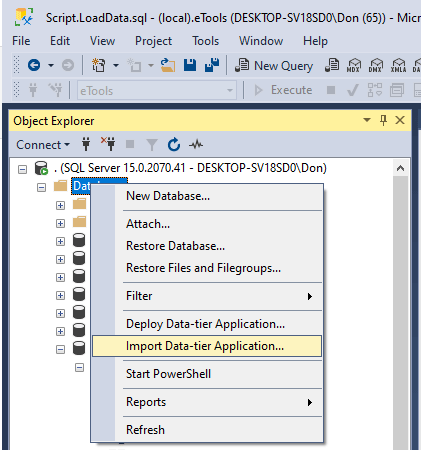

# Installing The eTools Database 

> Check the `DatabaseVersion` table for the version number - it should be **`1.1.0`**

An [eTools.bacpac](./eTools2021.bacpac) has been provided for you to install the database. Using Sql Server Management Studio (SSMS), simply right-click on *Databases* in the *Object Explorer* and choose "Import Data-tier Application...", then follow the instructions in the dialog.

An [eTools.bak](./eTools2021.bak) has been provided for you to install the database. Use the SQL Database Management document use the Student Notes of the course moodle site to restore .bak file. Remember, when restoring a .bak file, the file cannot be in Downloads, Desktop or under Documents of your file system.