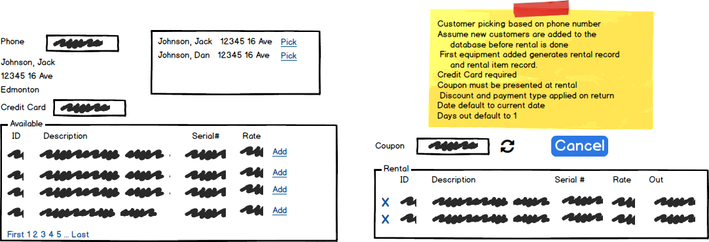
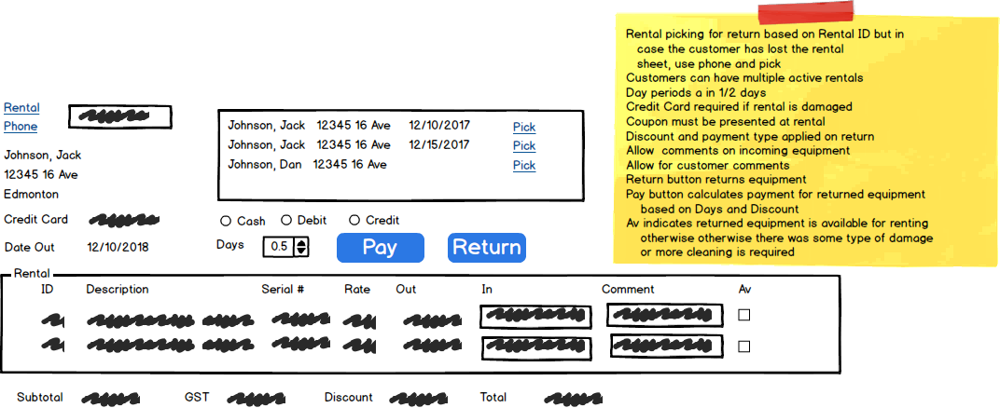
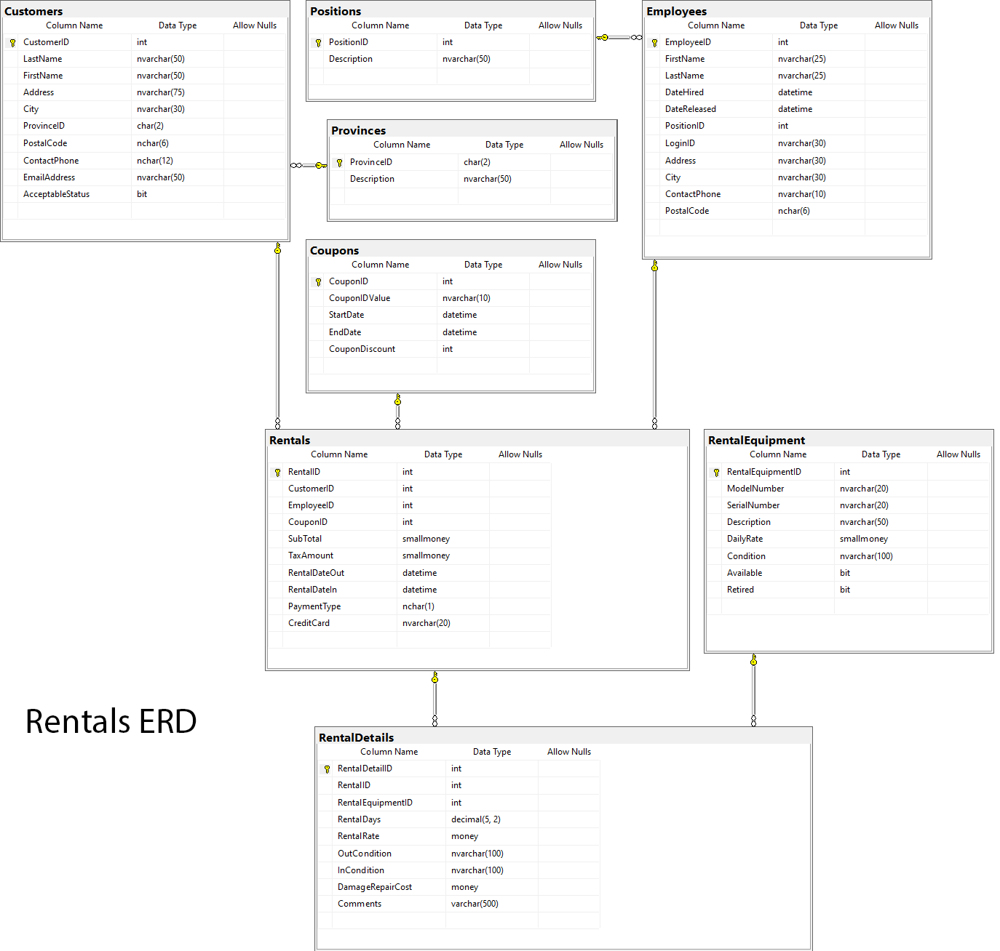

# Rentals

## Business Process Overview

> *Employees must log onto the system. Rentals must only allow authenicated users within the Rental Role to have access to the subsystem. An Associate, Store Manager or Department Head create rentals. The Employee full name must appear on the form in text mode*

The Rentals component requires the renter to have a customer record before the rental is done. You can assume this record exists. A rental record is created along with the rental detail(s) (each reflects a piece of rented equipment). A credit card is required. Coupons are presented at the time of rental. Customers return rented equipment, it is checked, comments recorded and the rental is paid. Customers do *not do* partial returns. If the rental period for equipment is expected to be different, then separate rentals are created. Example: the customer expects to rent equipment a, b, c and d; a, b and c for 1 day but piece d for a week. Two rental contracts will be created; one for a, b, and c; one for piece d. The smallest rental period is 1/2 day. A customer must be in good standing to rent equipment

### Renting

A customer will enter the rental area, approach the rental counter and request one or more pieces of equipment. Once the associate determines the equipment is available, the rental checkout process starts. The customer is asked for their phone number and their information is displayed. From the list of available equipment, a particular piece is selected (serial number is vertified manually). This equipment is added to the rental. Any piece can be remove from the rental or the entire rental cancelled if the customer changes their mind. Equipment is checked before the customer leaves with the equipment to ensure it is in working order. The associate will demonstrate how to use the equipment. Payment is done at when the equipment is returned. Any equipment not returned will be charged against the supplied credit card.

#### Business Rules and Form Processing

- Customer must supply a credit card to rent.
- Rental may have several pieces of equipment.
- Only available equipment is shown and can be added to the rental.
- Coupons must be presented and verified at rental time.
- An employee can only rent equipment if logged in.
- Default rental days is 1. This can be altered on return of the equipment. Smallest rental period is 1/2 day.
- Rental rate is daily.
- The customer can have several rentals out at one time.
- Rental date out is today's date and time.
- Rental date in is today's date plus the expected rental period.
- Rental condition in is set to "out on rental"
- Damage repair cost is set to 0.0.
- Comments is set to null
- Subttotals and tax are pre-coupon calculation.
- Default paymenttype to credit card
- flag the equipment as unavailable

----

### Returns

The Return process begins with the customer returning the equipment. The rental is retreived by rental number (from rental from) or by customer phone number. The equipment associated with the rental is displayed. Rental equipment is examined for cleaning and operation. Condition comments are recorded. The associate will ask the customer for any additional comments they wish to make. Time out periods are calculated by the associate and entered in 1/2 days. The equipment is returned and rental charges are calculated. The customer determines how payment is made and pays. The recorded credit card information is removed **if** there is no damage to the equipment regardless of payment type.

#### Business Rules and Form Processing

- Equipment is not flagged as available unless returned in clean working order.
- Add incoming condition.
- Add customer comments (if any).
- Any recorded coupon is apply to the pricing of the rental
- Payment types are 'M', 'C', or 'D', for 'Money', 'Credit' and 'Debit', respectively
- Subtotal, GST, Discount, and Total calculated on returned items.
- Subttotals and tax are pre-coupon calculation.
- Return / Pay button. Alters rental equipment, rental details records.
- Remove credit card information if all equipment has been returned in working order.
- Rental date in is today's date and time.

