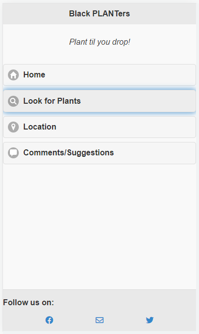
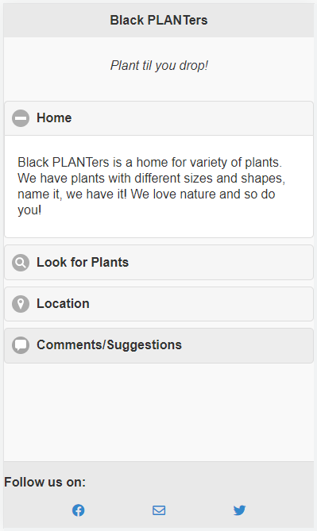
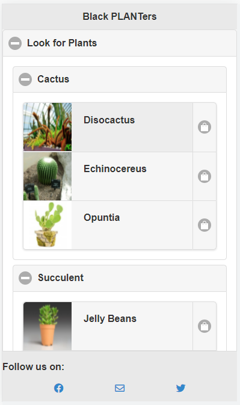
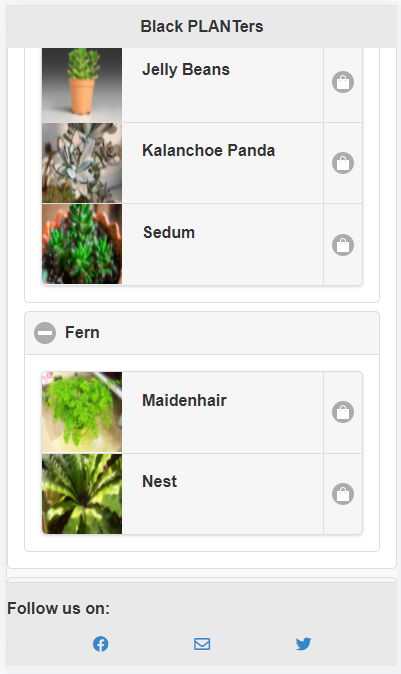
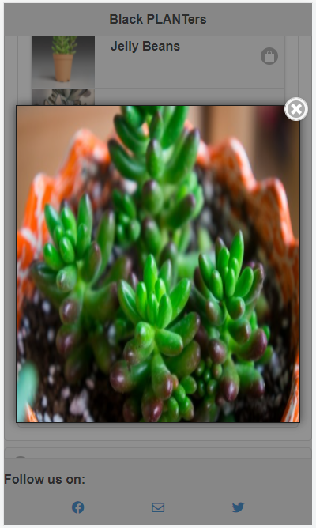
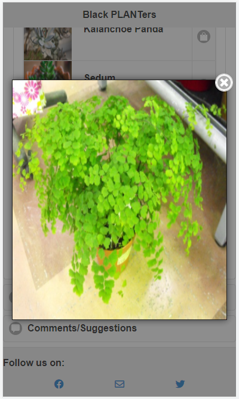
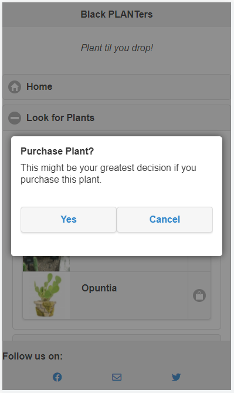
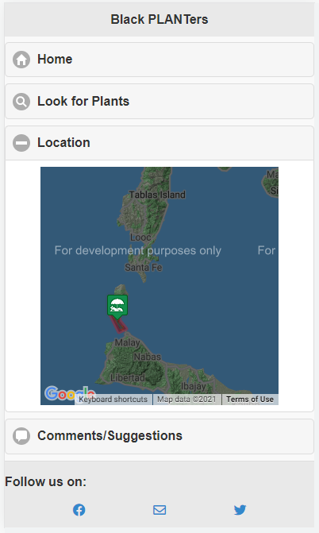
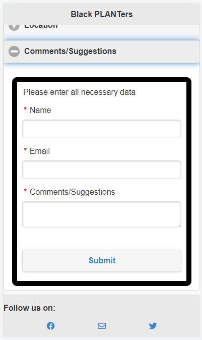

# Simple Mobile Site using jQuery Mobile Framework

## Homepage

  

## Listview gallery of plants

  

## Plants single view

  

## Click shop icon

  

## Location tab

> Implements the use of googlemaps api

  

## Comments tab

> Implements the use of forms for user's comments or suggestions

