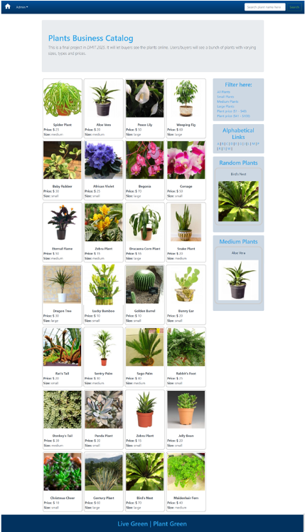
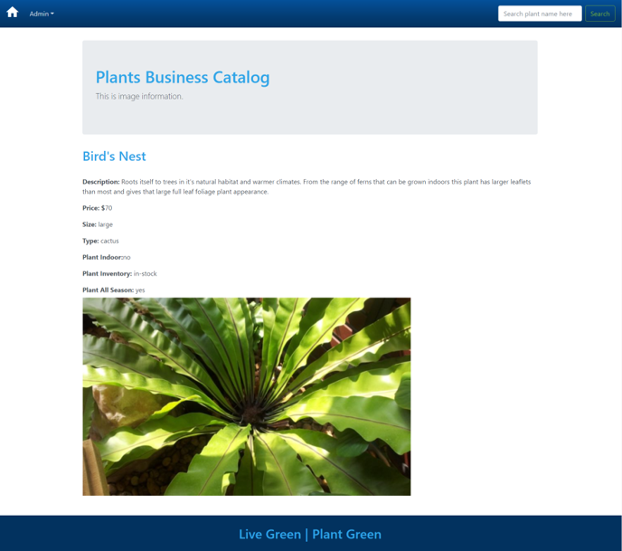
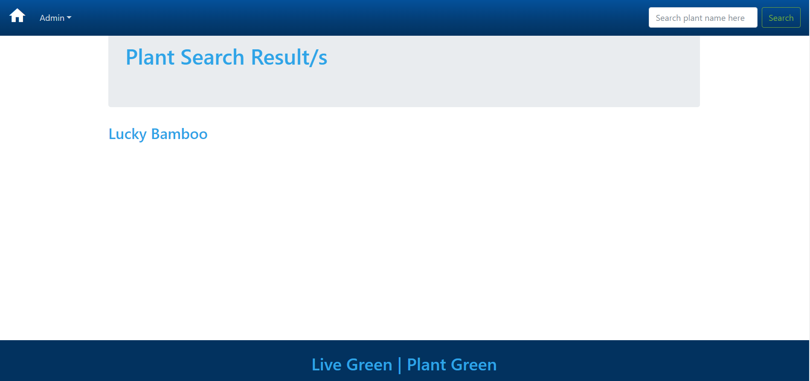
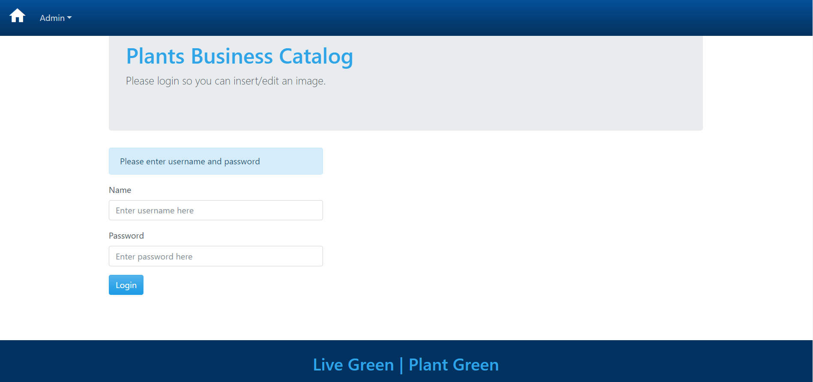
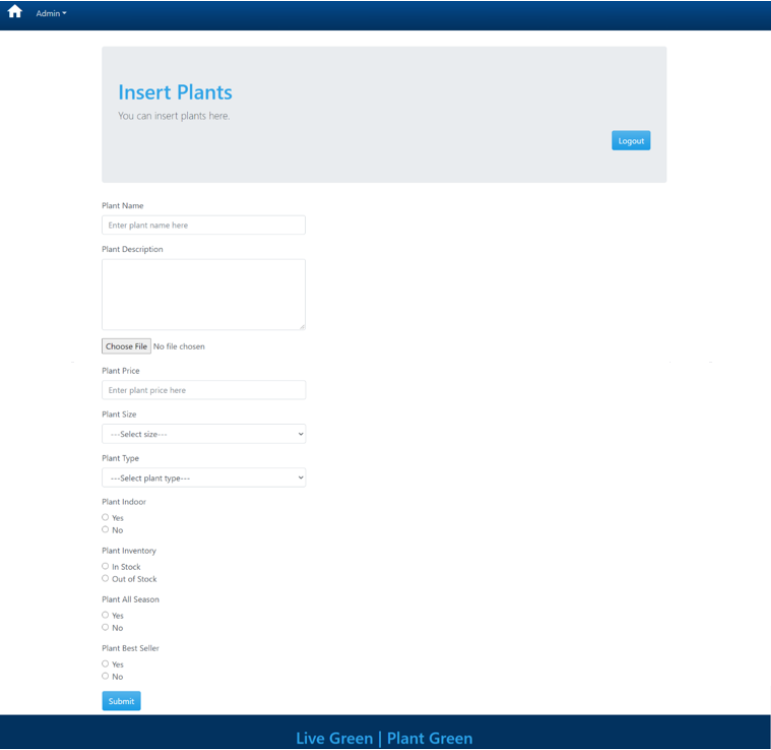
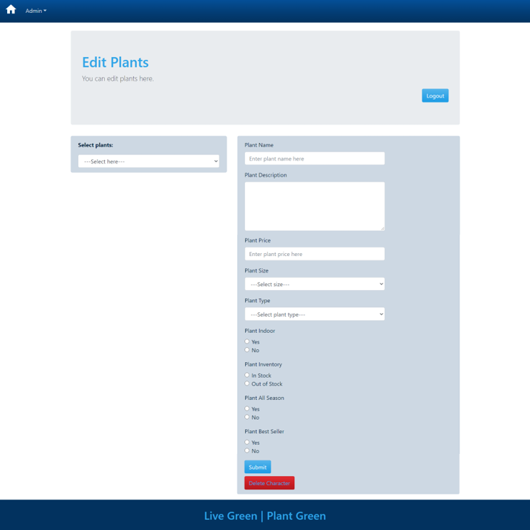
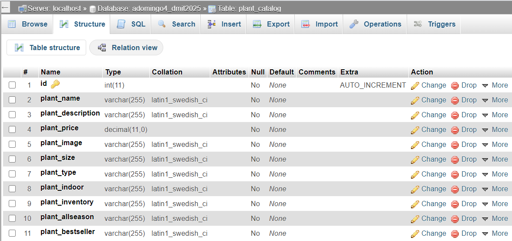

# PLANT BUSINESS CATALOG

## Description
This is my final project for DMIT2025 PHP/MySQL course I've taken at Northern Alberta Institute of Technology (NAIT). This is a catalog for a plant business that will let buyers see the plants online. Users/buyers will see a bunch of plants with varying sizes, types and prices. All the information of the plants will be entered in a database with fields such as plant name, plant description, plant price, plant size, plant type, etc.

Plants will be displayed right after the user opens the website. At the top of the homepage, user can see navigation for admin page and a search functionality. Admin page is secured with username and password and user must logged in prior to performing the CRUD functionality (add, edit, delete plants). Lastly, I've added a sidebar for filtering purposes and showing a random plants.

## Technology Used
- PHP
- MySQL
- CSS
    - Framework: Bootstrap
- NAIT server (below filezilla credentials)
    - Host: dmitstudent.ca
    - Username: adomingo4
    - Password: a**.s**wm*n7 

## Screenshots
- Working Website: http://adomingo4.dmitstudent.ca/dmit2025/week12/

### Homepage
- User will be redirected to this page upon opening the website

### Display page
- When user click an image

### Search Result page
- This is the result when user search for plant name

### Admin page
- Name: arr
- Password: arr123

### Insert page
- User can insert plant here

### Edit/Delete page
- User can edit and delete plants here

### Database Structure

## Known Bugs

| Bug       | Description   | Possible Fix  | Status    |
|:----------|:-------------:|:-------------:|:----------|
|Admin Page | When user click edit then enter the name and password, it will redirect to insert page instead of edit page   |https://stackoverflow.com/questions/36240145/how-to-use-serverhttp-referer-correctly-in-php https://www.youtube.com/watch?v=rMJgUQLikOE | IN-PROGRESS  |
|Select option in edit page |When selecting a plant, select is not prepopulating    |https://stackoverflow.com/questions/2460243/using-php-to-populate-a-select-select  |IN-PROGRESS    |
